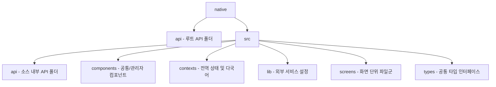

# React Native App Directory & Screen Guide

This document provides a comprehensive map of the entire directory structure, configurations, libraries, global state contexts, components, and screen components in the `native` application.

---

## 📂 Folder Structure Overview

---

## 🛠️ Configurations & Global Modules

### 1. `native/api` (Root API Folder)
백엔드 서버와의 주요 HTTP 비즈니스 로직 연동을 담당합니다.

| 파일명 | 기능 및 설명 |
| :--- | :--- |
| [auth.ts](file:///c:/Strongksm/Team-CAL/native/api/auth.ts) | 로그인, 회원가입, 출퇴근, 급여 조회, 근무 일정 관리, 대타 신청, 게시판 글 등록/수정/삭제, 댓글 관리 API 명세 |
| [translation.ts](file:///c:/Strongksm/Team-CAL/native/api/translation.ts) | Google Cloud Translation API 백엔드 호출 매핑 |

### 2. `src/api` & `src/lib` (Source API & Library Setup)
소스 내부의 서드파티 통신 모듈입니다.

| 파일명 | 기능 및 설명 |
| :--- | :--- |
| [src/api/translation.ts](file:///c:/Strongksm/Team-CAL/native/src/api/translation.ts) | 프론트엔드용 Google 번역 API 유틸리티 로직 (현재는 백그라운드 주석 처리) |
| [src/lib/supabase.ts](file:///c:/Strongksm/Team-CAL/native/src/lib/supabase.ts) | Supabase 백엔드 인스턴스 초기화 및 클라이언트 접속 설정 |

---

## 📂 Business Logic & Global Contexts (`src/contexts`)

앱 내 모든 컴포넌트에서 구독할 수 있는 React Context 기반 전역 상태 관리 모듈입니다.

| 파일명 | 기능 및 설명 |
| :--- | :--- |
| [AppContext.tsx](file:///c:/Strongksm/Team-CAL/native/src/contexts/AppContext.tsx) | 유저 정보(`userInfo`), 로그인 세션 세팅, 활성화 지점 정보 전역 관리 |
| [BoardContext.tsx](file:///c:/Strongksm/Team-CAL/native/src/contexts/BoardContext.tsx) | 사내 게시판 목록 로드(`loadPosts`), 새 글 등록(`addPost`), 수정(`updatePost`), 삭제(`deletePost`) 기능 제공 |
| [LanguageContext.tsx](file:///c:/Strongksm/Team-CAL/native/src/contexts/LanguageContext.tsx) | **다국어 매칭 사전(KO, EN, JA)** 및 `t('key')` 번역 헬퍼와 글로벌 언어셋 상태 전역 관리 |
| [NotificationContext.tsx](file:///c:/Strongksm/Team-CAL/native/src/contexts/NotificationContext.tsx) | 시스템 실시간 푸시 알림 리스트 관리 및 읽음 상태 제어 |
| [ScheduleContext.tsx](file:///c:/Strongksm/Team-CAL/native/src/contexts/ScheduleContext.tsx) | 개인별/매장별 캘린더 근무 정보 및 스케줄 상태 관리 |
| [ThemeContext.tsx](file:///c:/Strongksm/Team-CAL/native/src/contexts/ThemeContext.tsx) | 다크 모드 / 라이트 모드 전환 및 글로벌 색상 팔레트 주입 |

---

## 🧩 Reusable UI Components (`src/components`)

특정 화면군이나 앱 전역에서 재사용되는 개별 카드 및 팝업 모달 컴포넌트입니다.

### 📂 `src/components/admin` (관리자 전용 컴포넌트)
* [RequestManagementModal.tsx](file:///c:/Strongksm/Team-CAL/native/src/components/admin/RequestManagementModal.tsx): 휴무 요청 건의 세부 사항 확인 및 승인/거절 모달
* [ShiftEditorModal.tsx](file:///c:/Strongksm/Team-CAL/native/src/components/admin/ShiftEditorModal.tsx): 일별 전체 근무자 배치 목록 조회 및 수정 바로가기 팝업
* [TodayScheduleCard.tsx](file:///c:/Strongksm/Team-CAL/native/src/components/admin/TodayScheduleCard.tsx): 오늘 매장 근무 배정자 리스트 및 현재 현황 요약 카드

### 📂 `src/components/common` (공통 데이터 선택용 모달)
* [DatePickerModal.tsx](file:///c:/Strongksm/Team-CAL/native/src/components/common/DatePickerModal.tsx): 근무 편성 시 날짜 변경을 지원하는 날짜 다이얼로그
* [EmployeePickerModal.tsx](file:///c:/Strongksm/Team-CAL/native/src/components/common/EmployeePickerModal.tsx): 근무 스케줄 작성 시 직원을 할당해 주는 직원 검색 팝업
* [TimePickerModal.tsx](file:///c:/Strongksm/Team-CAL/native/src/components/common/TimePickerModal.tsx): 출퇴근 시각 편성용 시/분 타임 다이얼로그

### 📂 `src/components/dashboard` (대시보드 메인 카드)
* [NoticeSection.tsx](file:///c:/Strongksm/Team-CAL/native/src/components/dashboard/NoticeSection.tsx): 대시보드 공지사항 피드 섹션 **(카테고리/제목 다국어 지원)**
* [SubstituteAlertCard.tsx](file:///c:/Strongksm/Team-CAL/native/src/components/dashboard/SubstituteAlertCard.tsx): 동료의 긴급 대타 요청 건 요약 알림 및 지원 유도 팝업
* [TodayShiftCard.tsx](file:///c:/Strongksm/Team-CAL/native/src/components/dashboard/TodayShiftCard.tsx): 오늘 예정 근무 정보 표출 및 QR 출퇴근 트리거 연동 카드
* [WeeklyStatsCard.tsx](file:///c:/Strongksm/Team-CAL/native/src/components/dashboard/WeeklyStatsCard.tsx): 금주 실근무 누적 시간 및 예상 정산 금액 요약 통계 카드

---

## 📱 Detailed Screen Views (`src/screens`)

각 역할별 및 도메인 단위로 구성된 모바일 앱 화면 목록입니다.

### 📂 `src/screens/auth` (회원 인증)
| 파일명 | 기능 및 화면 설명 | 대상 사용자 |
| :--- | :--- | :--- |
| [LoginScreen.tsx](file:///c:/Strongksm/Team-CAL/native/src/screens/auth/LoginScreen.tsx) | 아이디, 비밀번호로 로그인 및 관리자/직원 모드 분기 | 공통 |
| [SignupChoiceScreen.tsx](file:///c:/Strongksm/Team-CAL/native/src/screens/auth/SignupChoiceScreen.tsx) | 가입 유형 선택 화면 (직원 회원가입 / 관리자 회원가입) | 공통 |
| [SignupScreen.tsx](file:///c:/Strongksm/Team-CAL/native/src/screens/auth/SignupScreen.tsx) | 개인 인적 사항 및 점주의 경우 매장 상세 정보 입력 가입 양식 | 공통 |
| [PendingScreen.tsx](file:///c:/Strongksm/Team-CAL/native/src/screens/auth/PendingScreen.tsx) | 신규 가입 후 점주의 승인을 대기하는 상태 안내 화면 | 신규 직원 |

### 📂 `src/screens/main` (대시보드 및 공통)
| 파일명 | 기능 및 화면 설명 | 대상 사용자 |
| :--- | :--- | :--- |
| [BranchSelectScreen.tsx](file:///c:/Strongksm/Team-CAL/native/src/screens/main/BranchSelectScreen.tsx) | 복수 지점 소속 직원이 근무할 매장을 선택하는 진입로 화면 | 직원 |
| [DashboardScreen.tsx](file:///c:/Strongksm/Team-CAL/native/src/screens/main/DashboardScreen.tsx) | 금일 근무 현황, 주간 예상 시급, 대타 긴급 알림, 최신 공지사항 피드 요약 | 공통 |
| [PayrollScreen.tsx](file:///c:/Strongksm/Team-CAL/native/src/screens/main/PayrollScreen.tsx) | 월별/주별 급여 정산 세부 정보 확인 화면 | 공통 |
| [QRCheckInScreen.tsx](file:///c:/Strongksm/Team-CAL/native/src/screens/main/QRCheckInScreen.tsx) | 매장에 비치된 QR 코드를 카메라로 스캔하여 실시간 출퇴근 처리 | 공통 |

### 📂 `src/screens/board` (사내 게시판 - 다국어 연동 완료)
| 파일명 | 기능 및 화면 설명 | 대상 사용자 |
| :--- | :--- | :--- |
| [BoardScreen.tsx](file:///c:/Strongksm/Team-CAL/native/src/screens/board/BoardScreen.tsx) | 카테고리별 글 조회 탭 및 게시글 리스트 뷰   *※ 카테고리 추가/삭제는 관리자 전용* | 공통 |
| [BoardDetailScreen.tsx](file:///c:/Strongksm/Team-CAL/native/src/screens/board/BoardDetailScreen.tsx) | 게시글 세부 정보 확인, 댓글 작성/삭제 및 본인 글/관리자 글 수정·삭제 | 공통 |
| [BoardWriteScreen.tsx](file:///c:/Strongksm/Team-CAL/native/src/screens/board/BoardWriteScreen.tsx) | 제목, 내용 작성 및 수정 모달 (작성 시 백그라운드 번역 직렬화 적용) | 공통 |
| [NotificationScreen.tsx](file:///c:/Strongksm/Team-CAL/native/src/screens/board/NotificationScreen.tsx) | 시스템 알림, 대타 알림 등의 수신 목록 확인 및 개별 확인/삭제 | 공통 |

### 📂 `src/screens/mypage` (마이페이지 및 위생/행정 서류)
| 파일명 | 기능 및 화면 설명 | 대상 사용자 |
| :--- | :--- | :--- |
| [MyPageScreen.tsx](file:///c:/Strongksm/Team-CAL/native/src/screens/mypage/MyPageScreen.tsx) | 내 프로필 정보 요약, 다국어 앱 설정(KO/EN/JA), 다크모드, 행정 메뉴 진입 | 공통 |
| [ProfileEditScreen.tsx](file:///c:/Strongksm/Team-CAL/native/src/screens/mypage/ProfileEditScreen.tsx) | 전화번호 수정 및 계정 비밀번호 변경 양식 | 공통 |
| [ContractScreen.tsx](file:///c:/Strongksm/Team-CAL/native/src/screens/mypage/ContractScreen.tsx) | 근로계약서 사진 업로드 및 점주 승인 상태 확인 | 직원 |
| [HealthCertScreen.tsx](file:///c:/Strongksm/Team-CAL/native/src/screens/mypage/HealthCertScreen.tsx) | 보건증 촬영 사진 제출, 만료일 관리(OCR 자동 분석 연동) 및 상태 확인 | 직원 |
| [MyPayslipsScreen.tsx](file:///c:/Strongksm/Team-CAL/native/src/screens/mypage/MyPayslipsScreen.tsx) | 그동안 정산된 급여 명세서의 월별 이력 확인 | 직원 |
| [WeeklyPayrollDetailScreen.tsx](file:///c:/Strongksm/Team-CAL/native/src/screens/mypage/WeeklyPayrollDetailScreen.tsx) | 이번 주 예상 시급에 포함된 요일별 상세 근무 내역 리스트 | 직원 |

### 📂 `src/screens/schedule` (개인/협업 근무 스케줄)
| 파일명 | 기능 및 화면 설명 | 대상 사용자 |
| :--- | :--- | :--- |
| [ScheduleScreen.tsx](file:///c:/Strongksm/Team-CAL/native/src/screens/schedule/ScheduleScreen.tsx) | 달력 기반 월간 근무 스케줄 조회, 휴무/대타 신청 트리거 작동 | 직원 |
| [SubstituteScreen.tsx](file:///c:/Strongksm/Team-CAL/native/src/screens/schedule/SubstituteScreen.tsx) | 다른 직원들의 대타 모집 공고 목록 확인 및 지원하기 신청 | 직원 |
| [SubstituteMatchingScreen.tsx](file:///c:/Strongksm/Team-CAL/native/src/screens/schedule/SubstituteMatchingScreen.tsx) | 내가 올린 대타 요청에 대한 직원들의 매칭 내역 관리 | 직원 |
| [MySubstitutePostDetailScreen.tsx](file:///c:/Strongksm/Team-CAL/native/src/screens/schedule/MySubstitutePostDetailScreen.tsx) | 내가 작성한 대타 모집글의 세부 내역 및 처리 현황 | 직원 |

### 📂 `src/screens/admin` (점주/관리자 전용 제어 화면)
| 파일명 | 기능 및 화면 설명 | 대상 사용자 |
| :--- | :--- | :--- |
| [AdminDashboardScreen.tsx](file:///c:/Strongksm/Team-CAL/native/src/screens/admin/AdminDashboardScreen.tsx) | 금일 매장 근무 현황, 휴무 신청/가입 승인 대기 수, 대타 요약 관리 대시보드 | 관리자 |
| [AdminScheduleScreen.tsx](file:///c:/Strongksm/Team-CAL/native/src/screens/admin/AdminScheduleScreen.tsx) | 캘린더 기반 매장 전체 직원 근무 일정 확인 및 일별 근무 수정/추가 진입 | 관리자 |
| [AdminDailyScheduleScreen.tsx](file:///c:/Strongksm/Team-CAL/native/src/screens/admin/AdminDailyScheduleScreen.tsx) | 특정 날짜에 배정된 매장 전체 근무자 배정 목록 및 편집기 연결 | 관리자 |
| [ShiftEditorScreen.tsx](file:///c:/Strongksm/Team-CAL/native/src/screens/admin/ShiftEditorScreen.tsx) | 스케줄 등록/변경을 위한 세부 편집 폼 (근무일, 시작/종료 시간, 직원 선택) | 관리자 |
| [EmployeeManagementScreen.tsx](file:///c:/Strongksm/Team-CAL/native/src/screens/admin/EmployeeManagementScreen.tsx) | 소속 매장의 전체 직원 리스트, 가입 승인 대기자 승인/반려 관리 | 관리자 |
| [EmployeeDetailScreen.tsx](file:///c:/Strongksm/Team-CAL/native/src/screens/admin/EmployeeDetailScreen.tsx) | 개별 직원의 전화번호 정보, 근로계약서 및 보건증 확인·승인/반려 세부 제어 | 관리자 |
| [LeaveRequestManagementScreen.tsx](file:///c:/Strongksm/Team-CAL/native/src/screens/admin/LeaveRequestManagementScreen.tsx) | 직원들이 올린 휴무 요청 목록 및 개별 승인/거절 처리 | 관리자 |
| [SubstituteManagementScreen.tsx](file:///c:/Strongksm/Team-CAL/native/src/screens/admin/SubstituteManagementScreen.tsx) | 직원들이 합의한 대타 매칭 건의 최종 결재 및 승인/거절 | 관리자 |
| [AttendanceRecordScreen.tsx](file:///c:/Strongksm/Team-CAL/native/src/screens/admin/AttendanceRecordScreen.tsx) | 직원들의 실제 QR 기반 출퇴근 기각 및 근무 이력 로그 조회 | 관리자 |
| [PayrollDetailScreen.tsx](file:///c:/Strongksm/Team-CAL/native/src/screens/admin/PayrollDetailScreen.tsx) | 매장 전체 근무자들의 기간별 합산 급여 명세 및 통계 조회 | 관리자 |
| [StoreEditScreen.tsx](file:///c:/Strongksm/Team-CAL/native/src/screens/admin/StoreEditScreen.tsx) | 매장의 기본 인적 정보(오픈/마감 시간, 주소, 허용 역량 등) 수정 폼 | 관리자 |
| [AddBranchScreen.tsx](file:///c:/Strongksm/Team-CAL/native/src/screens/admin/AddBranchScreen.tsx) | 점주 계정에 새로운 브랜드나 지점을 추가하고 생성하는 양식 | 관리자 |

---

## 📐 Common Type Declarations (`src/types`)

| 파일명 | 기능 및 타입 명세 |
| :--- | :--- |
| [Post.ts](file:///c:/Strongksm/Team-CAL/native/src/types/Post.ts) | `Post` 인터페이스 (아이디, 제목, 내용, 작성자, 상단 고정 여부, 카테고리 등) 및 `Comment` 인터페이스 정의 |
| [Schedule.ts](file:///c:/Strongksm/Team-CAL/native/src/types/Schedule.ts) | `Shift` 인터페이스 (근무 상태, 출퇴근 시간, 지점명 등) 및 휴무 신청 상태 명세 |
| [User.ts](file:///c:/Strongksm/Team-CAL/native/src/types/User.ts) | `User` 인터페이스 (아이디, 계정명, 역할 `ADMIN` / `STAFF`, 전화번호 등) 정의 |
