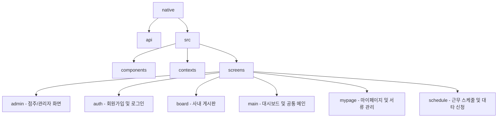

# React Native App Screens & Directory Guide

This document provides a detailed overview of the folder structure and screen components in the `native` folder, mapping each file to its corresponding screen and role.

---

## 📂 Folder Structure Overview

---

## 📱 Detailed Directory & Screen Reference

### 1. `src/screens/auth` (인증 및 계정 생성)
회원가입, 로그인, 가입 대기 화면을 포함합니다.

| 파일명 | 기능 및 화면 설명 | 대상 사용자 |
| :--- | :--- | :--- |
| [LoginScreen.tsx](file:///c:/Strongksm/Team-CAL/native/src/screens/auth/LoginScreen.tsx) | 아이디, 비밀번호로 로그인 및 관리자/직원 모드 분기 | 공통 |
| [SignupChoiceScreen.tsx](file:///c:/Strongksm/Team-CAL/native/src/screens/auth/SignupChoiceScreen.tsx) | 가입 유형 선택 화면 (직원 회원가입 / 관리자 회원가입) | 공통 |
| [SignupScreen.tsx](file:///c:/Strongksm/Team-CAL/native/src/screens/auth/SignupScreen.tsx) | 개인 인적 사항 및 점주의 경우 매장 상세 정보 입력 가입 양식 | 공통 |
| [PendingScreen.tsx](file:///c:/Strongksm/Team-CAL/native/src/screens/auth/PendingScreen.tsx) | 신규 가입 후 점주의 승인을 대기하는 상태 안내 화면 | 신규 직원 |

---

### 2. `src/screens/main` (메인대시보드 및 공통)
앱 진입 후 접근하게 되는 핵심 요약 및 연동 화면입니다.

| 파일명 | 기능 및 화면 설명 | 대상 사용자 |
| :--- | :--- | :--- |
| [BranchSelectScreen.tsx](file:///c:/Strongksm/Team-CAL/native/src/screens/main/BranchSelectScreen.tsx) | 복수 지점 소속 직원이 근무할 매장을 선택하는 진입로 화면 | 직원 |
| [DashboardScreen.tsx](file:///c:/Strongksm/Team-CAL/native/src/screens/main/DashboardScreen.tsx) | 금일 근무 현황, 주간 예상 시급, 대타 긴급 알림, 최신 공지사항 피드 요약 | 공통 |
| [PayrollScreen.tsx](file:///c:/Strongksm/Team-CAL/native/src/screens/main/PayrollScreen.tsx) | 월별/주별 급여 정산 세부 정보 확인 화면 | 공통 |
| [QRCheckInScreen.tsx](file:///c:/Strongksm/Team-CAL/native/src/screens/main/QRCheckInScreen.tsx) | 매장에 비치된 QR 코드를 카메라로 스캔하여 실시간 출퇴근 처리 | 공통 |

---

### 3. `src/screens/board` (사내 게시판)
사내 소통 및 업무 지시를 전달하는 게시판 영역입니다. **(다국어 연동 완료)**

| 파일명 | 기능 및 화면 설명 | 대상 사용자 |
| :--- | :--- | :--- |
| [BoardScreen.tsx](file:///c:/Strongksm/Team-CAL/native/src/screens/board/BoardScreen.tsx) | 카테고리별 글 조회 탭 및 게시글 리스트 뷰   *※ 카테고리 추가/삭제는 관리자 전용* | 공통 |
| [BoardDetailScreen.tsx](file:///c:/Strongksm/Team-CAL/native/src/screens/board/BoardDetailScreen.tsx) | 게시글 세부 정보 확인, 댓글 작성/삭제 및 본인 글/관리자 글 수정·삭제 | 공통 |
| [BoardWriteScreen.tsx](file:///c:/Strongksm/Team-CAL/native/src/screens/board/BoardWriteScreen.tsx) | 제목, 내용 작성 및 수정 모달 (작성 시 백그라운드 번역 직렬화 적용) | 공통 |
| [NotificationScreen.tsx](file:///c:/Strongksm/Team-CAL/native/src/screens/board/NotificationScreen.tsx) | 시스템 알림, 대타 알림 등의 수신 목록 확인 및 개별 확인/삭제 | 공통 |

---

### 4. `src/screens/mypage` (마이페이지 및 행정)
개인정보 수정 및 근로 계약, 위생 관리 등 전자 행정서류 제출 화면입니다.

| 파일명 | 기능 및 화면 설명 | 대상 사용자 |
| :--- | :--- | :--- |
| [MyPageScreen.tsx](file:///c:/Strongksm/Team-CAL/native/src/screens/mypage/MyPageScreen.tsx) | 내 프로필 정보 요약, 다국어 앱 설정(KO/EN/JA), 다크모드, 행정 메뉴 진입 | 공통 |
| [ProfileEditScreen.tsx](file:///c:/Strongksm/Team-CAL/native/src/screens/mypage/ProfileEditScreen.tsx) | 전화번호 수정 및 계정 비밀번호 변경 양식 | 공통 |
| [ContractScreen.tsx](file:///c:/Strongksm/Team-CAL/native/src/screens/mypage/ContractScreen.tsx) | 근로계약서 사진 업로드 및 점주 승인 상태 확인 | 직원 |
| [HealthCertScreen.tsx](file:///c:/Strongksm/Team-CAL/native/src/screens/mypage/HealthCertScreen.tsx) | 보건증 촬영 사진 제출, 만료일 관리(OCR 자동 분석 연동) 및 상태 확인 | 직원 |
| [MyPayslipsScreen.tsx](file:///c:/Strongksm/Team-CAL/native/src/screens/mypage/MyPayslipsScreen.tsx) | 그동안 정산된 급여 명세서의 월별 이력 확인 | 직원 |
| [WeeklyPayrollDetailScreen.tsx](file:///c:/Strongksm/Team-CAL/native/src/screens/mypage/WeeklyPayrollDetailScreen.tsx) | 이번 주 예상 시급에 포함된 요일별 상세 근무 내역 리스트 | 직원 |

---

### 5. `src/screens/schedule` (근무 관리 & 대타 연동)
근무 일정 조회 및 스케줄 조정 신청 화면입니다.

| 파일명 | 기능 및 화면 설명 | 대상 사용자 |
| :--- | :--- | :--- |
| [ScheduleScreen.tsx](file:///c:/Strongksm/Team-CAL/native/src/screens/schedule/ScheduleScreen.tsx) | 달력 기반 월간 근무 스케줄 조회, 휴무/대타 신청 트리거 작동 | 직원 |
| [SubstituteScreen.tsx](file:///c:/Strongksm/Team-CAL/native/src/screens/schedule/SubstituteScreen.tsx) | 다른 직원들의 대타 모집 공고 목록 확인 및 지원하기 신청 | 직원 |
| [SubstituteMatchingScreen.tsx](file:///c:/Strongksm/Team-CAL/native/src/screens/schedule/SubstituteMatchingScreen.tsx) | 내가 올린 대타 요청에 대한 직원들의 매칭 내역 관리 | 직원 |
| [MySubstitutePostDetailScreen.tsx](file:///c:/Strongksm/Team-CAL/native/src/screens/schedule/MySubstitutePostDetailScreen.tsx) | 내가 작성한 대타 모집글의 세부 내역 및 처리 현황 | 직원 |

---

### 6. `src/screens/admin` (점주/관리자 전용 제어 화면)
직원 관리, 근무 등록, 점주 전용 행정 승인 처리를 담당하는 핵심 화면군입니다.

| 파일명 | 기능 및 화면 설명 | 대상 사용자 |
| :--- | :--- | :--- |
| [AdminDashboardScreen.tsx](file:///c:/Strongksm/Team-CAL/native/src/screens/admin/AdminDashboardScreen.tsx) | 금일 매장 근무 현황, 휴무 신청/가입 승인 대기 수, 대타 요약 관리 대시보드 | 관리자 |
| [AdminScheduleScreen.tsx](file:///c:/Strongksm/Team-CAL/native/src/screens/admin/AdminScheduleScreen.tsx) | 캘린더 기반 매장 전체 직원 근무 일정 확인 및 일별 근무 수정/추가 진입 | 관리자 |
| [AdminDailyScheduleScreen.tsx](file:///c:/Strongksm/Team-CAL/native/src/screens/admin/AdminDailyScheduleScreen.tsx) | 특정 날짜에 배정된 매장 전체 근무자 배정 목록 및 편집기 연결 | 관리자 |
| [ShiftEditorScreen.tsx](file:///c:/Strongksm/Team-CAL/native/src/screens/admin/ShiftEditorScreen.tsx) | 스케줄 등록/변경을 위한 세부 편집 폼 (근무일, 시작/종료 시간, 직원 선택) | 관리자 |
| [EmployeeManagementScreen.tsx](file:///c:/Strongksm/Team-CAL/native/src/screens/admin/EmployeeManagementScreen.tsx) | 소속 매장의 전체 직원 리스트, 가입 승인 대기자 승인/반려 관리 | 관리자 |
| [EmployeeDetailScreen.tsx](file:///c:/Strongksm/Team-CAL/native/src/screens/admin/EmployeeDetailScreen.tsx) | 개별 직원의 전화번호 정보, 근로계약서 및 보건증 확인·승인/반려 세부 제어 | 관리자 |
| [LeaveRequestManagementScreen.tsx](file:///c:/Strongksm/Team-CAL/native/src/screens/admin/LeaveRequestManagementScreen.tsx) | 직원들이 올린 휴무 요청 목록 및 개별 승인/거절 처리 | 관리자 |
| [SubstituteManagementScreen.tsx](file:///c:/Strongksm/Team-CAL/native/src/screens/admin/SubstituteManagementScreen.tsx) | 직원들이 합의한 대타 매칭 건의 최종 결재 및 승인/거절 | 관리자 |
| [AttendanceRecordScreen.tsx](file:///c:/Strongksm/Team-CAL/native/src/screens/admin/AttendanceRecordScreen.tsx) | 직원들의 실제 QR 기반 출퇴근 기각 및 근무 이력 로그 조회 | 관리자 |
| [PayrollDetailScreen.tsx](file:///c:/Strongksm/Team-CAL/native/src/screens/admin/PayrollDetailScreen.tsx) | 매장 전체 근무자들의 기간별 합산 급여 명세 및 통계 조회 | 관리자 |
| [StoreEditScreen.tsx](file:///c:/Strongksm/Team-CAL/native/src/screens/admin/StoreEditScreen.tsx) | 매장의 기본 인적 정보(오픈/마감 시간, 주소, 허용 역량 등) 수정 폼 | 관리자 |
| [AddBranchScreen.tsx](file:///c:/Strongksm/Team-CAL/native/src/screens/admin/AddBranchScreen.tsx) | 점주 계정에 새로운 브랜드나 지점을 추가하고 생성하는 양식 | 관리자 |
